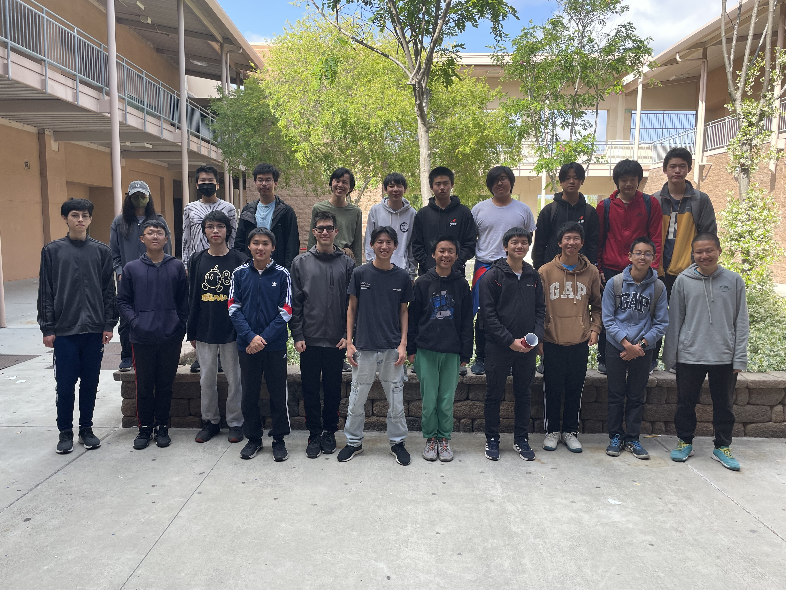

+++
title = "End of Year Announcements"
date = "2024-05-23T08:40:01-07:00"
template = "blog/page.html"
+++

We had our end of year celebration yesterday, concluding the 2023-24 school year for PPS. Over the past year, club members collectively made 2512 CodeForces submissions and solved a total of 1324 problems.

## Awards

Congratulations to:
1. Stephen Zhu
2. Hansen He
3. Kai Yi
4. Advait Choksi
5. Alex Backues

for solving the most problems this school year. The full leaderboard can be found [here](https://codeforces.com/group/56LvjuJGwY/customrating/5471) (you will likely need to login to CodeForces).

## Solution Slides

The solution slides for all the meetings this year can be found [here](https://drive.google.com/drive/folders/1F5o9yCPEHGq7jjpg4VldB9ZRJ5BVwygv?usp=sharing).

## Officers

The 2024-25 officers were announced yesterday. They are:
- President: Ryan Bai
- Vice Presidents: Alex Backues, Hansen He
- Treasurer: Lucas Han
- Secretary: Ryan Wu

Officer selection criteria included past club participation and programming level. We had a lot of applicants this year. Please don't feel discouraged if you weren't selected; keep on participating and programming and you'll get your chance next year.

## Group Photo

Here's the group photo we took yesterday.

 <!-- idk how i'm supposed to actually do this -->

## Conclusion

Overall, it was a great year of PPS. Our teams consistently ranked in nationwide competitions, and we saw many of our members promote in USACO. We also had a lot of fun chatting, collaborating, and solving problems in our weekly meetings. Many thanks to the officers this year for running the club.

We'll be seeing a few seniors graduate this year; we'll miss you and come back to visit often! For the rest of you, we look forward to seeing you again for the 2024-25 school year. Have a great summer everyone!
